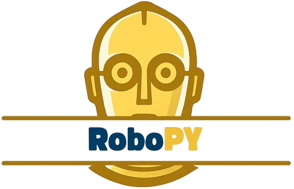

<p align="center">
  
</p>

<p align="left">
RoboPY è un sistema distribuito basato su un’architettura client-server, progettato per consentire l’interazione naturale tra un utente e un robot sociale, con l’obiettivo di stimare in tempo reale alcuni tratti della personalità dell’interlocutore.

Il client funge da intermediario tra l’essere umano e Furhat, un robot conversazionale dotato di espressività facciale e vocale. Il robot guida l’utente attraverso un breve questionario di personalità, formulando domande ispirate al modello **TIPI** (__Ten Item Personality Inventory__), volto a valutare i cinque tratti principali della personalità.
</p>


## Sommario
<p align="center"><a href="#built-with">Built With</a> - <a href="#getting-started">Getting Starded</a> - <a href="#prerequisites">Prerequisites</a> - <a href="#installation">Installation</a> - <a href="#docker">Docker</a> - <a href="#authors">Authors</a></p>


## Built With

[](https://www.python.org/)  [](https://en.wikipedia.org/wiki/C_(programming_language))


## Getting Started
Per eseguire localmente questo software è necessario seguire queste istruzioni.

### Prerequisites

È necessario installare le librerie `cjson` e `curl` per far funzionare il server.

### Installation

1. Crea una API key qui [https://console.groq.com/keys](https://console.groq.com/keys)
2. Clona la repository
   ```sh
   git clone https://github.com/LatteDiMandorla/RoboPy.git
   ```
3. Installa le dipendenze per il Client
   ```sh
   pip install requirements.txt
   ```
4. Crea un file `.env` ed inserisci al suo interno
   ```sh
   GROQ_API_KEY=<your-key>
   ```
## DOCKER
Il progetto è composto da due componenti principali: server (scritto in C) e client (in Python). Entrambi possono essere eseguiti in ambienti isolati tramite Docker.

### Prerequisites
- Docker (oppure Podman);
- ```docker-compose``` (non obbligatorio, ma consigliato).

### Avvio rapido
Dopo aver clonato la repository e inserito la API key:
1. Costruisci le immagini Docker 
  ```sh
   docker build -t lso-server ./server
   docker build -t robopy-client ./client
   ```
2. Avvia entrambi i container
  ```sh
  docker run -d -p 9999:9999 --name running-lso-server lso-server
  docker run -it --rm --name robopy-client --env SERVER_ADDRESS=host.docker.internal robopy-client
  ```

### Avvio con docker-compose
Puoi usare anche docker-compose per semplificare tutto:
```sh
docker-compose up --build
```
## AUTHORS
- [@Sderrr](https://github.com/Sderr12)
- [@LatteDiMandorla](https://github.com/LatteDiMandorla)

